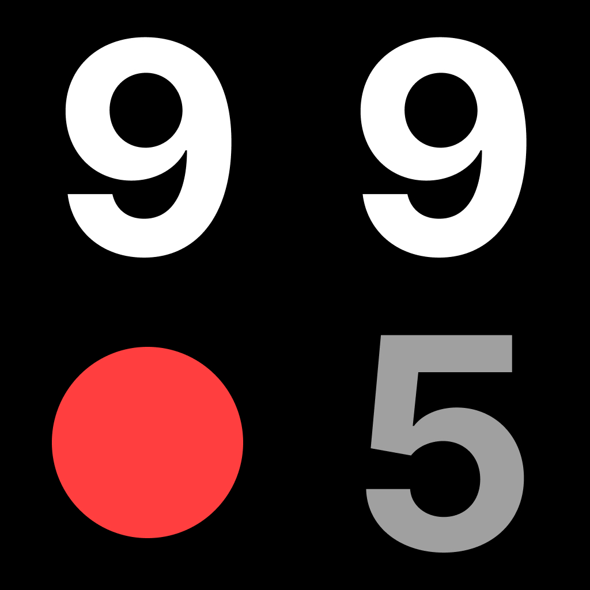

<!--
*** Thanks to the Best-README-Template for making this README look nice!
*** Get it here https://github.com/othneildrew/Best-README-Template
-->

<!-- PROJECT LOGO -->
<br />
<p align="center">
  <a href="https://almostanythingfor995.com/">
    
  </a>

  <h3 align="center">995</h3>

  <p align="center">
    What if everything was priced at 995? Or 9.95? or 99.5? This is a shop that dares to do so.
  </p>
</p>

### Built With

- [Astro 🚀](https://astro.build/)
- [Vue](https://astro.build/)
- [SnipCart](https://snipcart.com/)
- [TailwindCSS](https://tailwindcss.com/)

## Why?

Two reasons.

1) Support consumerism.
2) Try out the new Astro framework. Although unfortunately I don't really push the whole concept of island architecture with what I built. It was still fun learning the quirks of Astro and I'd like to really push the island architecture concept with future projects.

## Getting Started

To get a local copy up and running follow these simple steps.

- Get NodeJS and Yarn

### Installation

1. Clone the repo
   ```sh
   git clone https://github.com/github_username/repo_name.git
   ```
2. Install packages
   ```sh
   yarn install
   ```
3. Run in dev mode
   ```sh
   yarn dev
   ```
4. Visit `localhost:3000`!